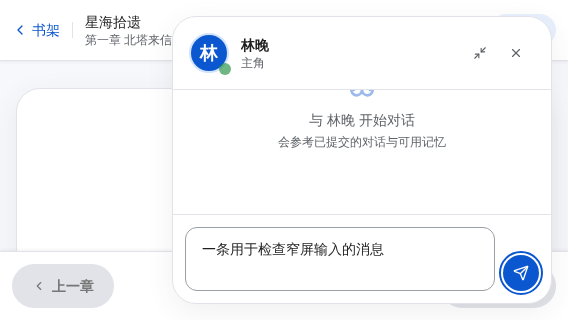
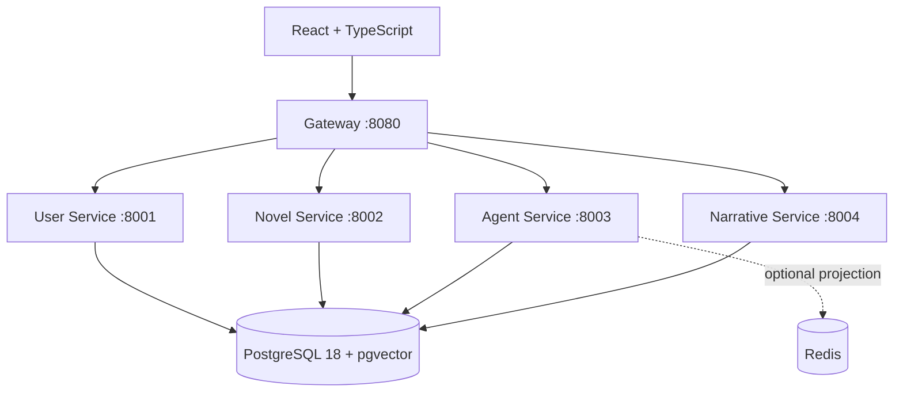

<div align="center">

# NovelWorld

**Read a novel. Talk to its characters. Make the next move.**

[](https://github.com/Wisdoverse/novelworld/actions/workflows/ci.yml)
[](./LICENSE)
[](./docs/PRODUCT_CONTRACT.md)

[Quick Start](#quick-start) · [Features](#features) · [Platform Support](#platform-support) · [Development](#development) · [Documentation](#documentation)

</div>

NovelWorld is an open-source, self-hosted platform for turning novels into
interactive worlds. Import a book, read at your own pace, chat with extracted
characters, and explore a new timeline as an original player.

> [!NOTE]
> **We are in rapid iteration and testing.** The current release is a private,
> single-node preview. Model quality, recovery, and human accessibility
> qualification are still in progress. See the [current product contract](./docs/PRODUCT_CONTRACT.md)
> and [roadmap](./docs/ROADMAP.md) for the supported scope and remaining work.

## Why NovelWorld?

- **Bring your own books.** Paste text or import TXT, EPUB, and text-extractable
  PDF files into your bookshelf.
- **Go beyond reading.** Talk to characters, follow branching choices, or create
  an original player and act inside the story world.
- **Keep your journey.** Committed conversations, choices, and world turns are
  stored in PostgreSQL so you can return to them.
- **Choose your setup.** Run a private Docker server or try a portable desktop
  build. Configure a DeepSeek/OpenAI-compatible provider when you need AI features.

## Quick Start

### Server — Linux or Windows

Install Git and Docker with Compose v2. On Windows, start
[Docker Desktop](https://docs.docker.com/desktop/setup/install/windows-install/)
first. For host requirements, see the [deployment guide](./DEPLOY.md#系统要求).

Clone the repository:

```bash
git clone https://github.com/Wisdoverse/novelworld.git
cd novelworld
```

**Linux:**

```bash
./start.sh
```

**Windows PowerShell:**

```powershell
.\start.cmd
```

You can also double-click `start.cmd` in the repository folder.

The launcher guides the initial database setup, generates the required secrets,
restarts itself once, and builds the application. When the services are ready,
open **http://localhost**.

1. Create the first administrator account. No model API key is needed for this step.
2. Open **Settings** and configure your provider, model, and API key.
3. Import a novel, wait for processing, and start reading.
4. Open a character conversation, follow a branch choice, or create an original
   player at an unlocked chapter to enter the world.

The default setup uses PostgreSQL; Redis is optional. Keep the preview on
localhost, or configure an encrypted private-network/TLS boundary before remote
access. For upgrades, backups, optional Redis, and troubleshooting, use
[DEPLOY.md](./DEPLOY.md); upgrades can require a maintenance window.

### Desktop — experimental portable builds

Look for the version-matched portable archives in
[GitHub Releases](https://github.com/Wisdoverse/novelworld/releases).
Extract the archive, then launch the application below. The bundle includes the
frontend, five Rust services, and local PostgreSQL; Docker and an external
NovelWorld server are not required.

| Platform | Archive | Launch |
|---|---|---|
| Windows 10/11 x64 | `novelworld-windows-x64-portable.zip` | `NovelWorld.exe` |
| Linux x64 | `novelworld-linux-x64-appimage.tar.gz` | The extracted AppImage |
| macOS Apple Silicon | `novelworld-macos-arm64-app.zip` | `NovelWorld.app` |
| macOS Intel | `novelworld-macos-x64-app.zip` | `NovelWorld.app` |

These are unsigned engineering builds with forward-only data migrations. Keep
application data paired with a compatible version; do not open newer data with
an older archive. AI features still send requests to the configured provider
and require Internet access and a key.

## Features

| Experience | What you can do |
|---|---|
| Bookshelf and import | Import a book or a bounded batch; attach an already parsed novel from the shared catalog while keeping your reading progress and journey private. |
| Reading and translation | Read by chapter, track progress, and request an on-demand Simplified Chinese rendering of the current chapter. |
| Character conversations | Open a streaming conversation and resume committed chat history. Available lore and memory are bounded by server-owned reading progress. |
| Branching stories | Choose a continuation at a branch point and see its committed consequences. |
| Open-world play | Create an original player at an unlocked checkpoint, then travel, investigate, converse, ally, or oppose. The timeline distinguishes your decisions from generated prose. |
| Model settings | Configure the platform provider after setup; signed-in readers may optionally use their own encrypted provider key. |

<p align="center">
  
</p>

*Character chat in a synthetic browser-test fixture. The current interface is in Simplified Chinese.*

### Input and language support

| Input | Current acceptance limit |
|---|---|
| Pasted text | 5 MiB |
| TXT | 10 MiB; UTF-8, BOM-marked UTF-16, or GBK |
| EPUB or text-extractable PDF | 20 MiB per file; extracted text up to 20 MiB |
| Batch upload | Up to 5 files, 40 MiB combined; per-file limits still apply |

Simplified Chinese and English have deterministic structural coverage. Generated
narrative transitions currently require Chinese text. Scanned/image-only PDFs
and DRM-protected files are unsupported. Accepted input does not guarantee model
extraction or translation quality; no language/model pair is release-qualified.

### Platform support

| Mode | Windows | Linux | macOS |
|---|---|---|---|
| Docker server | `start.cmd` | `./start.sh` | Not qualified |
| Portable desktop | x64 engineering build | x64 AppImage engineering build | Apple Silicon and Intel engineering builds |

For the full compatibility, privacy, source-visibility, and recovery boundaries,
see the [product contract](./docs/PRODUCT_CONTRACT.md). Operators need permission
to process their books and should review the configured provider's data and
billing policies; relevant source excerpts and conversations are sent to that provider.

## Architecture



| Layer | Stack and ownership |
|---|---|
| Frontend | React, TypeScript, Tailwind CSS; Feature-Sliced Design |
| Backend | Five Rust/Axum services; DDD layers and HTTP service boundaries |
| State | PostgreSQL is authoritative; Redis is an optional projection |
| Model integration | OpenAI-compatible requests, SSE chat streaming, bounded retries |
| Deployment | Docker Compose server or experimental Tauri desktop bundle |

The current topology is private `single-node-v1`, with a shared database.
Static architecture gates enforce code and relation-owner boundaries; database
isolation, horizontal scaling, and public-cloud readiness remain outside the
current claim. See [architecture and evidence limits](./docs/ARCHITECTURE.md#code-boundaries).

## Development

Start with [CONTRIBUTING.md](./CONTRIBUTING.md) for prerequisites, local setup,
and the affected-gate matrix. Common iteration commands:

```bash
cargo test -p novel-service
cargo run --locked -p architecture-check -- check
```

```bash
cd frontend
pnpm install --frozen-lockfile
pnpm dev
```

The Vite frontend runs at `http://localhost:5173` and needs a configured backend
at the gateway. Run `pnpm lint:fsd` for frontend architecture changes; follow the
[verification guide](./CONTRIBUTING.md#verification) for all affected checks.
CI is the authoritative merge gate.

Coding agents should read [AGENTS.md](./AGENTS.md), also available through the
`CLAUDE.md` symlink, before changing the repository.

## Documentation

| Looking for… | Start here |
|---|---|
| Setup, upgrades, and troubleshooting | [Deployment guide](./DEPLOY.md) |
| Current capabilities and limitations | [Product contract](./docs/PRODUCT_CONTRACT.md) |
| Product direction and active work | [Roadmap](./docs/ROADMAP.md) · [GitHub Projects](https://github.com/Wisdoverse/novelworld/projects) |
| Service boundaries and data ownership | [Architecture](./docs/ARCHITECTURE.md) |
| Intended behavior and implementation evidence | [Specification](./SPEC.md) · [Conformance ledger](./docs/SPEC_CONFORMANCE.md) |
| Data retention, export, and deletion | [Data lifecycle](./docs/DATA_RETENTION.md) · [Account export](./docs/ACCOUNT_EXPORT.md) |
| All engineering and operations documents | [Documentation index](./docs/README.md) |

## Contributing

Bug reports, focused fixes, documentation improvements, and reproducible test
results are welcome. Read [the contribution guide](./CONTRIBUTING.md), search
[existing issues](https://github.com/Wisdoverse/novelworld/issues), and include
steps to reproduce any problem. Report vulnerabilities through
[SECURITY.md](./SECURITY.md).

## License

[MIT](./LICENSE)
