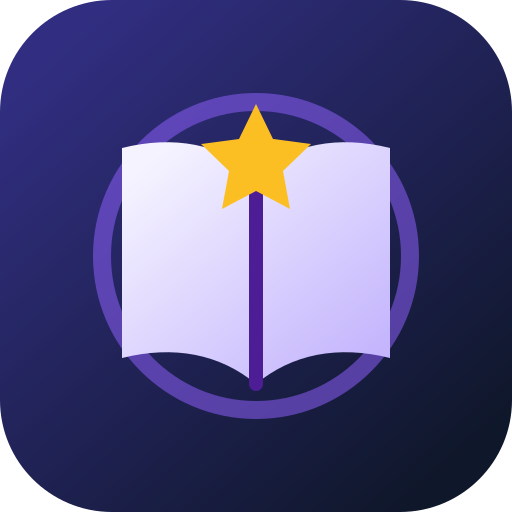
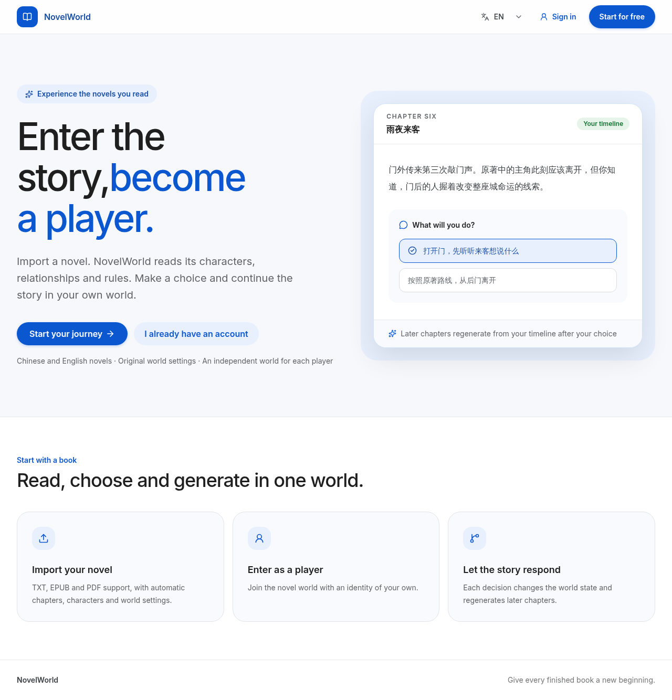

<div align="center">



# NovelWorld

[English](./README.md) · [简体中文](./README.zh-CN.md)

**Read a novel. Meet its characters. Shape a new path through the story.**

[](https://github.com/Wisdoverse/novelworld/actions/workflows/ci.yml)
[](./LICENSE)
[](./docs/PRODUCT_CONTRACT.md)

[📚 Features](#features) · [🚀 Quick start](#quick-start) · [🛡️ Limits](#support-and-limits) · [🧰 Development](#development) · [📖 Docs](#documentation)

</div>

NovelWorld is an open-source, self-hosted platform for interactive reading.
Import a novel, read by chapter, talk with its characters, and explore story
branches as an original player.

> [!NOTE]
> NovelWorld is a private, single-node preview. It does not support public Internet exposure.
> Keep it on localhost. Use an encrypted private-network or TLS boundary before
> remote access. Model quality, recovery, and accessibility are not qualified.
> Read the [product contract](./docs/PRODUCT_CONTRACT.md) and [roadmap](./docs/ROADMAP.md).

## Features

- 📚 **Bring your own books.** Paste text or import TXT, EPUB, and text-based PDF files.
- 📖 **Read and track progress.** Follow chapters and request a Simplified Chinese rendering of the current chapter.
- 💬 **Talk with characters.** Continue saved conversations within server-owned reading boundaries.
- 🧭 **Choose what happens next.** Follow branches or enter an open world as an original player at an unlocked chapter.
- 🌐 **Use your language.** The interface defaults to English and also supports Simplified Chinese. UI language does not change novel text or generation language.
- ⚙️ **Choose your model setup.** Configure DeepSeek for story generation. Embeddings can use a local model or an external OpenAI-compatible endpoint.

<p align="center">
  
</p>

*Interface presentation only. The story text is a static sample. This image does not show an authenticated journey or model quality.*

## Quick start

Install Git and Docker with Compose v2. On Windows, install
[Docker Desktop](https://docs.docker.com/desktop/setup/install/windows-install/).
Before you start the server on Windows, start Docker Desktop.

```bash
git clone https://github.com/Wisdoverse/novelworld.git
cd novelworld
```

Run the server launcher:

```bash
# Linux
./start.sh
```

```powershell
# Windows PowerShell
.\start.cmd
```

When setup completes, open **http://localhost**. Create the first administrator
account. This step needs no model API key. Open **Settings**.
Configure the provider, model, and key for AI features. See the [provider guide](./docs/LLM_PROVIDERS.md).

The default setup uses PostgreSQL. Redis is optional. Story generation needs an
Internet connection and a configured key. Source excerpts and conversations are
sent to the configured provider. Review that provider's data and billing policies.
Upload only works that you have the right or permission to process.

## Support and limits

| Area | Current boundary |
|---|---|
| Inputs | Pasted text: 5 MiB. TXT: 10 MiB (UTF-8, BOM-marked UTF-16, or GBK). EPUB or text-based PDF: 20 MiB per file. Extracted text: 20 MiB. |
| Batch upload | Select up to 50 files. The client sends at most 5 files and 40 MiB per request. Per-file limits still apply. |
| Language | English and Simplified Chinese have deterministic chapter-splitting and lore-retrieval fixtures. Generated narrative transitions require Chinese text. No language or model combination is release-qualified. |
| Unsupported files | NovelWorld does not support scanned or image-only PDFs or DRM-protected files. Accepted files do not guarantee extraction or translation quality. |
| Server platforms | Docker launchers target Linux and Windows 10/11. macOS server deployment is not qualified. |
| Desktop | Check [GitHub Releases](https://github.com/Wisdoverse/novelworld/releases) for available experimental, unsigned builds. Migrations are forward-only. Keep application data paired with a compatible version. |
| Optional previews | D20 rules and series worlds are structural previews. Full D&D gameplay and matching or adjudication quality are not claimed. |

The server uses five Rust/Axum services and a shared PostgreSQL database.
PostgreSQL owns authoritative state. Redis is an optional projection. Settings
may show token-cost estimates. They are not account bills. Database isolation,
horizontal scaling, and public-cloud readiness are outside the current claim.
See [architecture](./docs/ARCHITECTURE.md), [provider pricing](./docs/LLM_PRICING.md),
and the [data lifecycle](./docs/DATA_RETENTION.md).

## Development

Read [CONTRIBUTING.md](./CONTRIBUTING.md) for setup and validation guidance.
Common checks include:

```bash
cargo test -p novel-service
cargo run --locked -p architecture-check -- check
```

```bash
cd frontend
pnpm install --frozen-lockfile
pnpm dev
```

The Vite frontend runs at `http://localhost:5173` and needs a configured backend
gateway. CI is the authoritative merge gate. Coding agents should read
[AGENTS.md](./AGENTS.md) before changing the repository.

## Documentation

- 🚀 [Setup, upgrades, and recovery](./DEPLOY.md)
- 📋 [Product contract and limits](./docs/PRODUCT_CONTRACT.md)
- 🗺️ [Roadmap and active work](./docs/ROADMAP.md)
- 🏗️ [Architecture and data ownership](./docs/ARCHITECTURE.md)
- 📑 [Specification and conformance](./SPEC.md) · [ledger](./docs/SPEC_CONFORMANCE.md)
- 🔐 [Data lifecycle](./docs/DATA_RETENTION.md) · [account export](./docs/ACCOUNT_EXPORT.md)
- 🤝 [Contributing](./CONTRIBUTING.md) · [all documentation](./docs/README.md)

## Contributing

Read [CONTRIBUTING.md](./CONTRIBUTING.md) before preparing a change.
Report bugs through [GitHub Issues](https://github.com/Wisdoverse/novelworld/issues).
Report vulnerabilities through the private process in [SECURITY.md](./SECURITY.md).

## License

NovelWorld is available under the [MIT License](./LICENSE).
