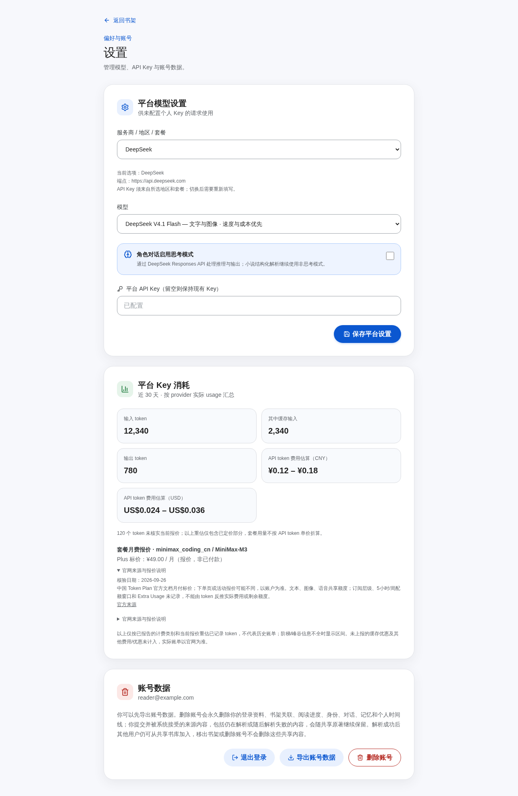

# LLM 计费估算

本文面向管理员和运维，定义设置页 Key 用量卡的报价来源、计算方式与限制。
它是当前 token 费用重估和套餐报价，不能替代平台账单、余额或配额查询。
provider、地区、套餐用途限制见 [LLM 配置](./LLM_PROVIDERS.md)。



*真实构建页面使用合成浏览器 fixture 的截图；token 和估算金额为测试数据，
不构成实际用量或账单证据。套餐标价取自本次官网快照。*

## 来源和覆盖范围

[官网价格快照](../services/user-service/src/infrastructure/llm-prices.json)
随 User Service 构建发布，记录 `verified_on`、精确 `provider/model`、原币种、
输入/缓存命中/输出价格范围及官网链接；请求不访问外部价格网站。当前快照
核验日期为 **2026-09-26**，并不保证官网此后未调价。运行时按快照重估近 30 天
已报告计费类别，不重建历史单次调用账单。

| 平台 | 默认 API 报价范围 | 套餐报价 |
|---|---|---|
| DeepSeek | Flash、官网确认的旧 Flash 名称、V4 Pro；USD 峰谷价 | 无 Coding Plan 预设 |
| OpenAI | GPT-4o mini 标准实时 API；USD | 无 Coding Plan 预设 |
| 智谱 / Z.ai | CN CNY、国际 USD；GLM 5.3 / Flash | 分区月付标价；不套用旧 V2 报价 |
| MiniMax | CN CNY、国际 USD；M3 上下文阶梯、M2.7 / highspeed | 两区 Token Plan 月付标价；下单或活动价可能不同 |
| 千问 / 百炼 | 北京 CN CNY、新加坡 International USD；Plus / Flash / Coder Plus 阶梯 | 两区 Pro 正常月费；促销以下单页为准 |
| Kimi | CN CNY、国际 USD；K2.6 | 两区 Code 月费未核实 |
| 阶跃星辰 | CN CNY、国际 USD；Step 3.5 Flash | 两区 Flash 月付报价 |
| 文心 / 千帆 | ERNIE 4.5 Turbo 128K 输入/输出；CNY；精确缓存价未知 | 已停止续订，历史月费未知 |
| 豆包 / 方舟 | Seed 2.1 Pro 精确版本价未核实 | 月费未核实 |
| 混元 / 硅基流动 | 当前预设旧模型已下线，不用历史价格冒充当前单价 | 无套餐预设 |

自定义模型与历史标签只有精确匹配才可计价；不依据当前选项重映射旧记录。
`environment` 等无法确认平台的标签、未核实缓存价或未知模型用量会计入未定价
token。下线预设保持可见以说明已有配置，价格表不会自动替换模型或 Key。

## 计算方式

Prometheus 提供当前 Key 的 `cached_input`、`uncached_input`、`output` 增量。
普通 API 每一类按 `tokens × 每百万 token 单价 ÷ 1,000,000` 计算，累加同币种
金额。单价和金额均以整数微元/微美元保存，不用浮点金额；每类四舍五入到
一微单位。人民币与美元各显示一个小计，不使用推测汇率合并。

例如 MiniMax M2.7 普通输入 100 万、输出 50 万、缓存命中 0：CN token
估算为 `2.10 + 0.5 × 8.40 = ¥6.30`；国际版为
`0.30 + 0.5 × 1.20 = $0.90`。两者分别使用各区官网报价。

峰谷时间、单次输入长度、思考模式未保留在当前汇总里，因此以相应类别的
已核实最低/最高单价分别计算区间。它描述当前价格下已报告类别的重估范围，
不构成历史账单的上下界。免费精确价可产生零金额；未知价和金额溢出不能
产生假零金额，仍显示未定价用量。

缓存字段缺失时，现有采集把输入列为普通输入，未报告的缓存优惠未计入。
缓存写入/创建/保留、工具、独立图像/语音生成、税费、账户优惠、赠送余额等不在
这份 token 汇总中。Qwen 缓存按隐式缓存规则计价；显式缓存写入和保留费未
统计，详见 [官方缓存计费](https://www.alibabacloud.com/help/en/model-studio/context-cache)。
标准服务报价不覆盖请求显式选择的 Fast/Priority/Batch 服务。

Coding/Token Plan 的 `plans` 只展示官网月付报价，不代表用户已购买或已付款。
累计 token 无法确定套餐等级、购入日期、首月优惠、共享额度、点数折算、
5 小时/周窗口或 Extra Usage；套餐用量保留在未按 API 单价计价的 token 中。
不能把同名普通 API 单价套到套餐上，报价也不授予被条款禁止的后端用途。

## 配置、更新和恢复

默认 `{}` 使用官网快照。运维可通过 `LLM_PRICING_USD_PER_MILLION` 或
`LLM_PRICING_CNY_PER_MILLION` 显式覆盖精确普通 API 模型，二者采用相同 JSON
结构，价格单位为各自原币种每百万 token，例如人民币：

```json
{"custom/model":{"cached_input":"0.14","uncached_input":"0.70","output":"2.10"}}
```

覆写优先于快照，包括未核实模型；页面注明运维配置来源，不伪造官网核验
日期。同键同时出现在两个币种、套餐 token 覆写、负数或超过六位的小数，
以及无效快照日期/范围/HTTPS 来源都会使 User Service 启动失败。可删除错误
覆写恢复默认，再检查 `/ready`。不要为恢复而修改已冻结的 Diagnostic 注册。

`USD_CNY_RATE` 为可选正数汇率，仅为兼容旧版 `costs` 点估算字段提供换算；
新页面显示原币种。区间或无法可靠合并的混合币种不会压成一个旧版点估算。
价格配置及快照不改写 Diagnostic 注册价格、预算、阈值或历史证据。

更新价格时：逐一打开对应官方精确模型/地区文档，核对单位、普通与缓存价、
上下文/峰谷/思考档位和促销条件；更新快照及核验日期；运行
`cargo test --locked -p user-service llm_usage` 和受影响前端检查，经独立复核
与 CI 后发布 User Service。无法确认的报价留空，不采用第三方价格补齐。
每次官网调价、别名迁移、套餐调整或新模型预设都触发复核。

这项功能增加 API 的 `estimates`、`pricing_references` 字段，保留 contract 1
和旧字段；新页面可消费旧后端响应。无数据库迁移或新增模型调用，回滚已有
User Service / frontend 镜像即可撤回计算展示；旧版可能恢复手配报价提示。
Prometheus 未启用或没有保留历史指标时，此功能无法补回遗漏用量；用量读取
失败仍显示不可用状态，不替换为零费用。
